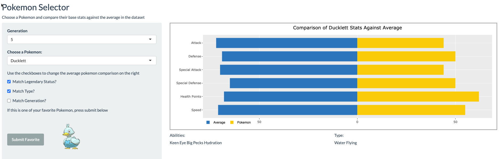
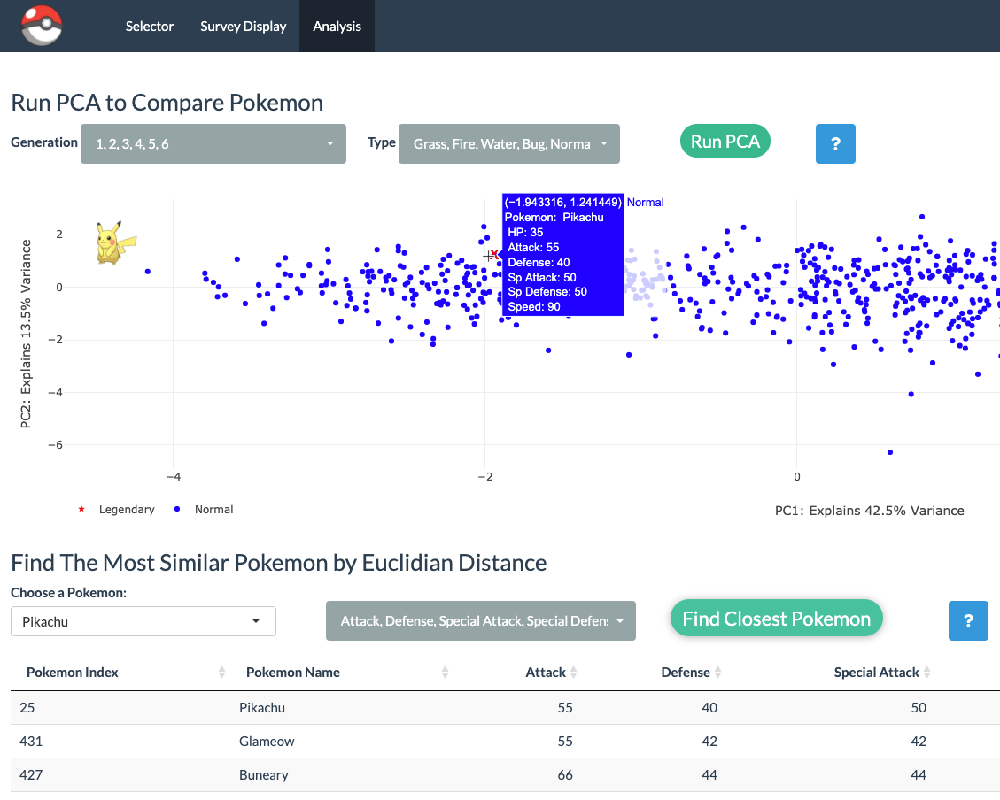

# Two way analytics with R Shiny and Pokemon
Home of the fabulous Pokemon Shiny app and the medium article I wrote/
All application code is found in the app.R file

## Links
### Article 
https://medium.com/swlh/two-way-analytics-with-r-shiny-and-pokemon-e9eae225fd46

### Web app
https://marshallp.shinyapps.io/pokeshiny/

### Data
Images downloaded from Kaggle here: https://www.kaggle.com/vishalsubbiah/pokemon-images-and-types
Pokemon dataset downloaded here:
https://www.kaggle.com/rounakbanik/pokemon

